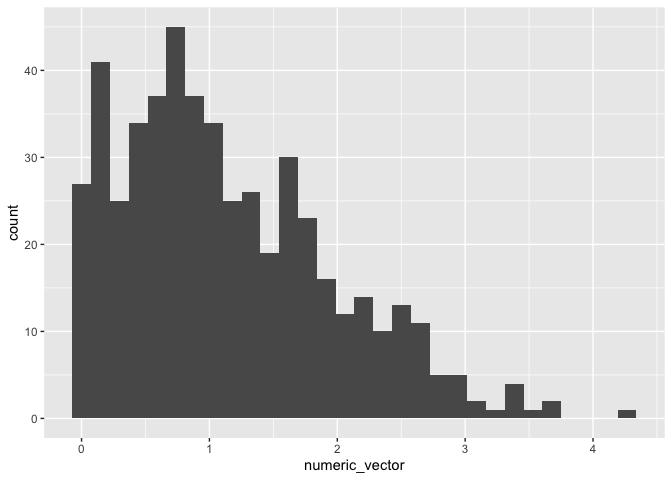
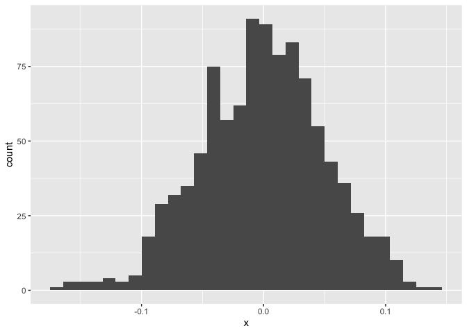

A really not so simple document
================
2026-09-17

I’m an R Markdown document!

# Section 1

Here’s a **code chunk** that samples from a *normal distribution*:

``` r
samp = rnorm(100)
length(samp)
```

    ## [1] 100

# Section 2

I can take the mean of the sample, too! The mean is -0.0443178.

# Section 3: a tibble

    ## ── Attaching core tidyverse packages ──────────────────────── tidyverse 2.0.0 ──
    ## ✔ dplyr     1.2.1     ✔ readr     2.2.0
    ## ✔ forcats   1.0.1     ✔ stringr   1.6.0
    ## ✔ ggplot2   4.0.3     ✔ tibble    3.3.1
    ## ✔ lubridate 1.9.5     ✔ tidyr     1.3.2
    ## ✔ purrr     1.2.2     
    ## ── Conflicts ────────────────────────────────────────── tidyverse_conflicts() ──
    ## ✖ dplyr::filter() masks stats::filter()
    ## ✖ dplyr::lag()    masks stats::lag()
    ## ℹ Use the conflicted package (<http://conflicted.r-lib.org/>) to force all conflicts to become errors

    ## # A tibble: 6 × 2
    ##          x     y
    ##      <dbl> <dbl>
    ## 1  0.0433  1.99 
    ## 2 -0.0975  0.777
    ## 3 -0.00368 1.13 
    ## 4  0.0149  2.73 
    ## 5  0.0741  1.59 
    ## 6  0.00902 2.19

# Section 5: Learning Assessment

Write a named code chunk that creates a dataframe comprised of: a
numeric variable containing a random sample of size 500 from a normal
variable with mean 1; a logical vector indicating whether each sampled
value is greater than zero; and a numeric vector containing the absolute
value of each element. Then, produce a histogram of the absolute value
variable just created. Add an inline summary giving the median value
rounded to two decimal places. What happens if you set eval = FALSE to
the code chunk? What about echo = FALSE?

Solution

``` r
set.seed(0)

data_frame <- 
  tibble(
    numeric_var = rnorm(500, mean = 1),
    logical_vector = case_when(
      numeric_var >= 0 ~ 1,
      numeric_var < 0 ~ 0), 
    log_var = numeric_var > 0,
    numeric_vector = abs(numeric_var)
  )

data_frame |> 
  ggplot() + 
  geom_histogram(mapping = aes(x = numeric_vector))
```

    ## `stat_bin()` using `bins = 30`. Pick better value `binwidth`.

<!-- -->

``` r
round(median(data_frame$numeric_vector), digits = 2)
```

    ## [1] 0.99

``` r
# If eval = FALSE, then the block of code does not run
# If echo = FALSE, then block of code does not appear in R Markdown file 
```

The median is 0.99  
The median is 0.99

# Section 6 Formatting

## Text formatting

*italic* or *italic* **bold** or **bold** `code` superscript<sup>2</sup>
and subscript<sub>2</sub>

## Headings

# 1st Level Header

## 2nd Level Header

### 3rd Level Header

## Lists

- Bulleted list item 1

- Item 2

  - Item 2a

  - Item 2b

1.  Numbered list item 1

2.  Item 2. The numbers are incremented automatically in the output.

## Tables

| First Header | Second Header |
|--------------|---------------|
| Content Cell | Content Cell  |
| Content Cell | Content Cell  |

# Section 7: Learning Assessment 3

After the previous code chunk, write a bullet list given the mean,
median, and standard deviation of the original random sample.

- The median is 0.99.

- The mean is 1.14.

- The standard deviation is 0.82.

This plot shows the distribution of the absolute value.

What if I try to add a histogram?

``` r
ggplot(plot_df, aes(x = x)) + geom_histogram()
```

    ## `stat_bin()` using `bins = 30`. Pick better value `binwidth`.

<!-- -->
